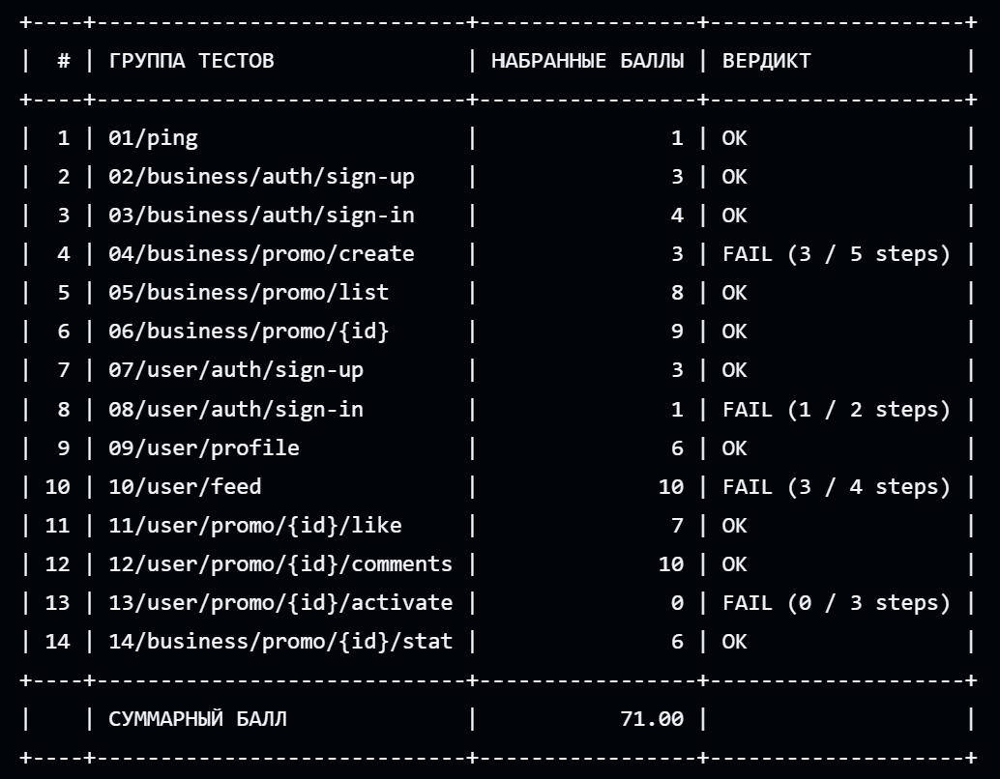

# PROMO v2: Promo Code Backend

Это ваш личный репозиторий для решения второго этапа в треке Backend.
Вы можете редактировать файлы **только в директории `solution`**.

Условие задания и публичные тесты доступны [в данном репозитории](https://github.com/Sarch-Zity/PROD-2025-second-stage/tree/main/FAQ-2025-main/backend).

## Результаты этапа:


Для запуска api с бд и антифродом:
```bash
# Из директории solution
docker-compose up
```